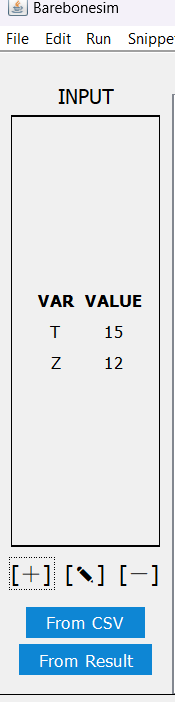

# Barebone programming language and Barebonesim

> [Bản dịch Tiếng Việt ở đây](README.md)

This repository contains basic information about the *Barebone programming language*, some code for basic calculation and a Barebone compiler program in GUI, for the final presentation topic in my *Principles of Programming Languages* class.

The goals are:

1. Presents about the Barebone programming language.

2. Builds a program that compiles code in Barebone to perform addition, subtraction, multiplication, division and comparison operation.

3. Builds the program in GUI.

<!-- Table of Contents -->

<details open>
   <summary><b>Table of Contents</b></summary>
   <ul>
      <li>
         <a href="#barebone-programming-language">Barebone Programming Language</a>
         <ul>
            <li><a href="#language-features">Language Features</a></li>
            <li><a href="#syntax">Syntax</a></li>
            <li>
               <a href="#reviews">Reviews</a>
               <ul>
                  <li><a href="#basic-operations">Basic operations</a></li>
                  <li><a href="#using-a-loop-in-place-of-clear-statement">Using a loop in place of clear statement</a></li>
                  <li><a href="#representing-negative-integers">Representing negative integers</a></li>
               </ul>
            </li>
         </ul>
      </li>
      <li>
         <a href="#gui-compiler-program">GUI Compiler Program</a>
         <ul>
            <li><a href="#prerequisites">Prerequisites</a></li>
            <li><a href="#installation">Intallation</a></li>
            <li>
               <a href="#usage">Usage</a>
               <ul>
                  <li><a href="#startup">Startup</a></li>
                  <li><a href="#code">Code</a></li>
                  <li><a href="#use-snippets">Use snippets</a></li>
                  <li><a href="#assign-starting-values-for-variables">Assign starting values for variables</a></li>
                  <li><a href="#execute-and-view-results">Execute and view results</a></li>
               </ul>
            </li>
            <li><a href="#example">Example</a></li>
            <li>
               <a href="#features">Features</a>
               <ul>
                  <li><a href="#how-does-barebonesim-compile-barebone">How does Barebonesim compile Barebone?</a></li>
                  <li><a href="#does-barebonesim-support-input-and-output">Does Barebonesim support input and output?</a></li>
                  <li><a href="#does-barebonesim-support-code-commenting">Does Barebonesim support code commenting?</a></li>
               </ul>
            </li>
            <li><a href="#contributing">Contributing</a></li>
            <li><a href="#license">License</a></li>
         </ul>
      </li>
   </ul>
</details>

## Barebone Programming Language

### Language Features

Barebone is a procedural programming language with these features :

- Barebone does not have subroutines such as functions and procedures.

- Code can only contain statements. Each statement must ends with a semicolon `;`.

- The only data type is **non-negative integer**.

- Variables are global. When first mentioned in a statement, the variable is set to zero before executing the statement.

- A loop can be nested in another loop.

- There are no standard I/O.

- Case-insensitive. For example, `X` and `incr` are the same as `x` and `INCR`, respectively.

- Keywords are `clear`, `decr`, `do`, `end`, `incr`, `not` and `while`.

- Variable names can only contain ASCII alphanumeric or underscore `_`. Variable names do not start with a digit. Variable names are case-insensitive and cannot be the same as any keyword.

### Syntax

There are three statements in Barebone:

- `clear X;` assign the variable `X` to zero.

- `incr X;` increase `X` by one.

- `decr X;` decrease `X` by one if it is greater than zero.

and a loop structure

```
while X not 0 do ... end;
```

that works in two steps

1. Exits the loop if `X` is zero, otherwise goes to step 2.

2. Sequentially executes statements in the `...` until the statement `end;`. Goes to step 1.

Each space can be replaced by a newline or a tab (four whitespaces) for readability, for example `while X not 0 do decr X end;` is the same as

```
while X not 0 do
    decr X;
end;
```

or

```
while X not 0 do
decr X;
end;
```

It is recommended to add newlines and tabs at right places for readability.

Example of a valid code snippet:

```
clear Y;
clear T;
while X not 0 do
    incr Y;
    incr T;
    decr X;
end;
while T not 0 do
    incr X;
    decr T;
end;
```

### Reviews

Files mentioned in this section can be found in `app/src/main/resources/snippets/`.

#### Basic operations

- Branching structure `if X != 0 then X := 0 else X := 1` in `toggle.txt`. It can be called `invert X`.

- Addition operation `Z := X + Y` in file `add.txt`.

- Subtraction operation `Z := X - Y` in file `subtract.txt`.

- Multiplication operation `Z := X * Y` in file `multiply.txt`.

- Integer division operation `Z := floor(X / Y)` in file `int_divide.txt`.

- Comparison operation `if X < Y then Z := 0 else Z := 1` in file `less_than.txt`, can be rewritten in pseudo-code as:

```
Z := 0
T_X := X
T_Y := Y
while T_Y != 0 do
    Z := Z + 1
    T_Y := T_Y - 1
while T_X != 0 do
    if Z > 0 then Z := Z - 1
    T_X := T_X - 1
T_X := T_X + 1
while Z != 0 do
    T_X := 0
    Z := 0
while T_X != 0 do
    Z := Z + 1
    T_X := T_X - 1
```

- Other comparison operations can be found in `not_less_than.txt`,
   `greater_than.txt`, `not_greater_than.txt`, `equals.txt`,
   `not_equals.txt`.

#### Using a loop in place of clear statement

In place of `clear X`, we can use this code:

```
while X not 0 do
    decr X;
end;
```

#### Representing negative integers

A *signed* integer $X$ can be represented in Barebone using a sign variable. The sign variable `X_NEG` equals zero if $X \ge 0$, otherwise it does not equal zero.

For example, an integer $X$ can be represented with

- `X` as the absolute value of $X$ and

- `X_NEG` as the sign variable.

We can change the sign of $X$ using this operation

```
if X_NEG != 0 then X_NEG := 0 else X_NEG := 1
```

## Compiler Program in GUI

**Barebonesim** (Barebone + Simulator) is a Barebone compiling simulation Java program in GUI. Barebonesim is built with Gradle 7.5.1.

### Prerequisites

Oracle JDK 1.8+ is required. Check the version of Java using this command

```powershell
java -version
```

If Java is not available, download it following the instruction on [java.com](https://www.java.com/en/download/) and run the command above to confirm the version.

### Installation

Clone this repo.

```
git clone https://github.com/hnthap/barebonesim.git -depth 1
```

### Usage

#### Startup

In the top level directory of this repo (containing the file `gradlew`), run this command

```powershell
./gradlew run
```

This window will appear :

<p align="center" width="100%"></p>

The main window insists of

- Menu bar ("Thanh menu") contains basic command to interact with file and code,

- Toolbar ("Thanh công cụ") contains buttons (from left to right) to run code, open file, save file, check for errors and "beautify" code, create snippets and close file.

- Code area ("Cửa sổ soạn thảo") to write and change source code.

- Input window ("Cửa sổ Input", on the left of the Code area) to work with input variables.

- Output window ("Cửa sổ Output", on the right of the Code area) to work with the result of variables after executing code.

- Current file's absolute path is displayed below the Code area ("Thanh hiển thị địa chỉ").

#### Code

Code can be written directly in the Code area. Click on `🗁` in Toolbar to open a file. Save the code by clicking on `💾` in Toolbar.

While coding, check for errors and "beautify" code by clicking on `❀` (the flower icon) in Toolbar.

#### Use snippets

To save your coding time, use existing snippets that perform basic operations (addtion, subtraction, multiplication, division, comparison, Boolean toggling, changing a variable's sign).

#### Assign starting values for variables

Using Input window (on the left of the Code area), you can assign starting values for some variables.

- To add new variable, select `[+]` (the plus sign). Enter the variable's name and value and select OK.

- To change the value of a variable, select `[✎]` (the pencil icon). Choose the variable to change, select OK and enter its new value, select OK.

- To remove a variable from the list, select `[-]` (the minus sign). Choose the variable to remove and select OK.

These are starting values of variables before the code is executed.

> Alternatively, these variables can be added from a CSV file. Click on ` From CSV ` button and choose the file. CSV file follows [RFC 4180](https://www.ietf.org/rfc/rfc4180.txt) and *does NOT contain the header row*.
> 
> An example for a valid CSV file :
> 
> ```csv
> X,12
> Y,20
> Z,0
> ```

#### Execute and view results

After starting values of variables and the code are completed, execute (run) the code by clicking on `▶` (the triangle icon) in Toolbar.

If an error is catched in code (invalid variable name, infinite loop, etc.) or it's executed beyond the time limit ($1000 \;\textrm{ms}$ by default), the program will notify about the error and stop.

If successfully executed, the values of variables *after executing* will be displayed on Output window (on the right of the Code area).

> Save results to a CSV file by clicking on ` Extract to CSV ` on Output window.
>
> Bring results on Output window to Input window by clicking on ` From Result ` on Input window.

If the code and starting values of variables are changed after execution, update the Output window by execute again.

### Example

For example, to perform `A := Z * T` with specified values of `Z` and `T`:

1. On Menu bar, select File &rarr; New File and create new file.

2. After a new file is created and opened, on Menu bar, select Snippets &rarr; Snippets.

3. On "Snippets" window, choose `Z := X * Y` and select OK.

4. On "Snippet Settings" window, rename variables as below and select OK.
   
   <p align="center" width="100%"></p>
   
   > Remember to name temporary variables so that they don't have the same name with any variables in use. Two variables in the same snippet cannot have the same name. Temporary variable names should start with "T" or "T_".
   >
   > Temporary variables can be reused in other operations. After an operation perform by a snippet, all temporary variables will be set to zero.

5. On "Here You Have" window, select all new code and press <kbd>Ctrl</kbd> + <kbd>C</kbd> (or equivalent shortcut to copy text) and select OK.

   <p align="center" width="100%"></p>

6. In the Code area, press <kbd>Ctrl</kbd> + <kbd>V</kbd> (or equivalent shortcut to paste text).

7. Click on `[+]` on Input window (on the left of the Code area), then enter the name and starting value of `Z` (equals $12$ for example).
   
   <p align="center" width="100%"></p>
   
   Do the same thing for `T` (equals $15$ for example).
   
   <p align="center" width="100%"></p>
   
   The Input window will be displayed like this:
   
   <p align="center" width="100%"></p>

8. Click on `▶` in Toolbar to execute your code. The main window can be like below:

   <p align="center" width="100%"></p>

   On the Output window (on the right of the Code area), we see that `A` equals $180$, which is what we need.

### Features

#### How does Barebonesim compile Barebone?

Code is compiled and executed arcording to the following steps:

1. Starting values of variables (on the Input window, on the left of the Code area) are stored in a `VariableContainer` object. It stores all "input" variables by their names and values.

2. *Parser* converts code into a list of *abstract syntax trees*. Each of them represents a statement. (A loop is also a statement.)

3. While parsing, if a syntax error is detected, Parser will stop and report the error.

4. If the parsing process is success, the list of abstract syntax trees will be stored in *Compiler* and be executed sequentially in another thread. All changes in variables' values will be applied in a copy of the `VariableContainer` object in the first step.

5. If the code is executed beyond the time limit (timeout), Compiler will stop and report the error. (The time limit is $1000 \;\textrm{ms}$ by default and can be modified.)

6. If executed successfully, final values in the `VariableContainer` will be displayed on Output window (on the right of the Code area).

All steps are performed in Barebonesim's runtime. **There is no executable file created.**

#### Does Barebonesim support input and output?

Conceptually, Barebone only supports `incr`, `decr`, `clear` and `while` statements, other than that there is no more statements. Some Barebone compilers additionally support `read` and `print` statements to enter and print a variable's value.

Although, to emphasize the simplicity of Barebone, Barebonesim does not support standard I/O. Instead, the results can be displayed on Output window.

#### Does Barebonesim support code commenting?

Barebonesim does not yet support code commenting.

### Contributing

If you have any suggestion, feel free to fork this repo and create a pull request. Any contributions are greatly appreciated. I may be slow to respond to pull requests, but I'll try to respond later.

### License

Distributed under the MIT License. See `LICENSE` for more information.

<!--Acknowlegdements-->
