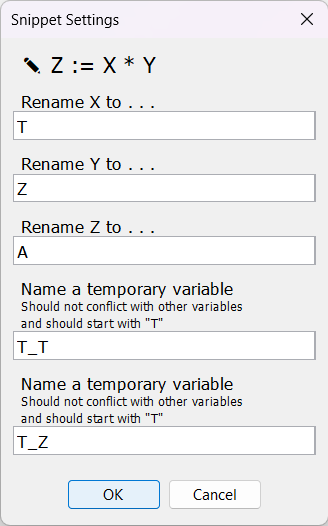
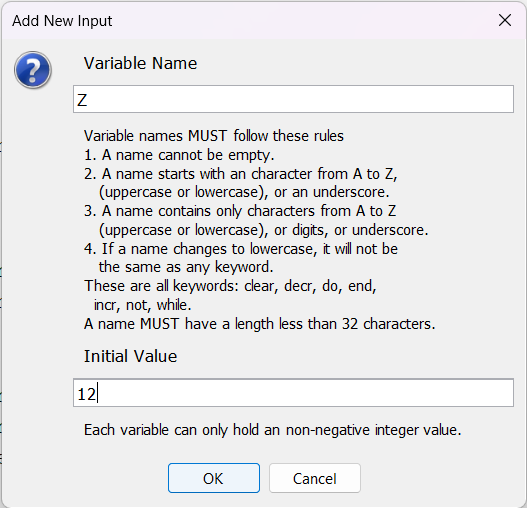

# Barebone programming language and Barebonesim

> [Tiếng Việt](README.md)

This repository contains basic information about the *Barebone programming language*, some code for basic calculation and a Barebone compiler program in GUI, for a final presentation topic in my *Principles of Programming Languages* class.

The goals are:

1. Presents about the Barebone programming language.

2. Builds a program that compiles code in Barebone to perform addition, subtraction, multiplication, division and comparison operation.

3. Builds the program in GUI.

<!-- Table of Contents -->

<details open>
   <summary><em>Table of Contents</em></summary>
   <ol>
      <li>
         <a href="#ngôn-ngữ-lập-trình-barebone">
            Ngôn ngữ lập trình Barebone
         </a>
         <ul>
            <li><a href="#đặc-điểm-của-barebone">
               Đặc điểm của Barebone
            </a></li>
            <li><a href="#cú-pháp">Cú pháp</a></li>
            <li>
               <a href="#nhận-xét">Nhận xét</a>
               <ul>
                  <li><a href="#phép-toán-cơ-bản">Phép toán cơ bản</a></li>
                  <li><a href="#có-thể-thay-clear-bằng-vòng-lặp">
                     Có thể thay clear bằng vòng lặp
                  </a></li>
                  <li><a href="#biểu-diễn-số-nguyên-âm">
                     Biểu diễn số nguyên âm
                  </a></li>
               </ul>
            </li>
         </ul>
      </li>
      <li>
         <a href="#chương-trình-biên-dịch-ở-dạng-đồ-họa">
            Chương trình biên dịch ở dạng đồ họa
         </a>
         <ul>
            <li><a href="#yêu-cầu">Yêu cầu</a></li>
            <li>
               <a href="#sử-dụng">Sử dụng</a>
               <ul>
                  <li><a href="#khởi-động">Khởi động</a></li>
                  <li><a href="#soạn-thảo">Soạn thảo</a></li>
                  <li><a href="#sử-dụng-code-có-sẵn">
                     Sử dụng code có sẵn
                  </a></li>
                  <li><a href="#đặt-giá-trị-ban-đầu-cho-biến">
                     Đặt giá trị ban đầu cho biến
                  </a></li>
                  <li><a href="#thực-thi-và-xem-kết-quả">
                     Thực thi và xem kết quả
                  </a></li>
               </ul>
            </li>
            <li><a href="#ví-dụ">Ví dụ</a></li>
            <li>
               <a href="#đặc-điểm">Đặc điểm</a>
               <ul>
                  <li><a href="#barebonesim-dịch-bb-bằng-cách-nào">
                     Barebonesim dịch BB bằng cách nào ?
                  </a></li>
                  <li><a href=
                     "#barebonesim-có-hỗ-trợ-nhập-và-xuất-giá-trị-không">
                     Barebonesim có hỗ trợ nhập và xuất giá trị không ?
                  </a></li>
                  <li><a href=
                     "#barebonesim-có-hỗ-trợ-comment-trong-code-không">
                     Barebonesim có hỗ trợ comment trong code không ?
                  </a></li>
               </ul>
            </li>
         </ul>
      </li>
   </ol>
</details>

## Barebone Programming Language

### Language Features

Barebone is a procedural programming language with these features :

- Barebone does not have subroutines such as functions and procedures.

- Code can only contain statements. Each statement must ends with a semicolon `;`.

- The only data type is **non-negative integer**.

- Variables are global. When first mentioned in a statement, the variable is set to zero before executing the statement.

- A loop can be nested in another loop.

- There are no standard I/O.

- Case-insensitive. For example, `X` and `incr` are the same as `x` and `INCR`, respectively.

- Keywords are `clear`, `decr`, `do`, `end`, `incr`, `not` and `while`.

- Variable names can only contain ASCII alphanumeric or underscore `_`. Variable names do not start with a digit. Variable names are case-insensitive and cannot be the same as any keyword.

### Syntax

There are three statements in Barebone:

- `clear X;` assign the variable `X` to zero.

- `incr X;` increase `X` by one.

- `decr X;` decrease `X` by one if it is greater than zero.

and a loop structure

```
while X not 0 do ... end;
```

that works in two steps

1. Exits the loop if `X` is zero, otherwise goes to step 2.

2. Sequentially executes statements in the `...` until the statement `end;`. Goes to step 1.

Each space can be replaced by a newline or a tab (four whitespaces) for readability, for example `while X not 0 do decr X end;` is the same as

```
while X not 0 do
    decr X;
end;
```

or

```
while X not 0 do
decr X;
end;
```

It is recommended to add newlines and tabs at right places for readability.

Example of a valid code snippet:

```
clear Y;
clear T;
while X not 0 do
    incr Y;
    incr T;
    decr X;
end;
while T not 0 do
    incr X;
    decr T;
end;
```

### Reviews

Files mentioned in this section can be found in `app/src/main/resources/snippets/`.

#### Basic operations

- Branching structure `if X != 0 then X := 0 else X := 1` in `toggle.txt`. It can be called `invert X`.

- Addition operation `Z := X + Y` in file `add.txt`.

- Subtraction operation `Z := X - Y` in file `subtract.txt`.

- Multiplication operation `Z := X * Y` in file `multiply.txt`.

- Integer division operation `Z := floor(X / Y)` in file `int_divide.txt`.

- Comparison operation `if X < Y then Z := 0 else Z := 1` in file `less_than.txt`, can be rewritten in pseudo-code as:

```
Z := 0
T_X := X
T_Y := Y
while T_Y != 0 do
    Z := Z + 1
    T_Y := T_Y - 1
while T_X != 0 do
    if Z > 0 then Z := Z - 1
    T_X := T_X - 1
T_X := T_X + 1
while Z != 0 do
    T_X := 0
    Z := 0
while T_X != 0 do
    Z := Z + 1
    T_X := T_X - 1
```

- Other comparison operations can be found in `not_less_than.txt`,
   `greater_than.txt`, `not_greater_than.txt`, `equals.txt`,
   `not_equals.txt`.

#### Using a loop in place of clear statement

In place of `clear X`, we can use this code:

```
while X not 0 do
    decr X;
end;
```

#### Representing negative integers

A signed integer $X$ can be represented in Barebone using a sign variable. The sign variable `X_NEG` equals zero if $X \ge 0$, otherwise it does not equal zero.

For example, an integer $X$ can be represented with

- `X` as the absolute value of $X$ and

- `X_NEG` as the sign variable.

We can change the sign of $X$ using this operation

```
if X_NEG != 0 then X_NEG := 0 else X_NEG := 1
```

## Compiler Program in GUI

**Barebonesim** (Barebone + Simulator) is a Barebone compiling simulation Java program in GUI. Barebonesim is built with Gradle 7.5.1.

### Prerequisites

Oracle JDK 1.8+ is required. Check the version of Java using this command

```powershell
java -version
```

If Java is not available, download it following the instruction on [java.com](https://www.java.com/en/download/) and run the command above to confirm.

### Usage

#### Startup

In the top level directory of this repo (containing the file `gradlew`), run this command

```powershell
./gradlew run
```

This window will appear :

<p align="center" width="100%"></p>

The main window insists of

- Menu bar ("Thanh menu") contains basic command to interact with file and code,

- Toolbar ("Thanh công cụ") contains buttons (from left to right) to run code, open file, save file, check for errors and "beautify" code, create snippets and close file.

- Code area ("Cửa sổ soạn thảo") to write and change source code.

- Input window ("Cửa sổ Input", on the left of the Code area) to work with input variables.

- Output window ("Cửa sổ Output", on the right of the Code area) to work with the result of variables after executing code.

- Current file's absolute path is displayed below the Code area ("Thanh hiển thị địa chỉ").

#### Code

Code can be written directly in the Code area. Click on `🗁` in Toolbar to open a file. Save the code by clicking on `💾` in Toolbar.

While coding, check for errors and "beautify" code by clicking on `❀` (the flower icon) in Toolbar.

#### Use snippets

To save your coding time, use existing snippets that perform basic operations (addtion, subtraction, multiplication, division, comparison, Boolean toggle, changing a variable's sign).

#### Assign starting values for variables

Using Input window (on the left of the Code area), you can assign starting values for some variables.

- To add new variable, select `[+]` (the plus sign). Enter the variable's name and value and select OK.

- To change the value of a variable, select `[✎]` (the pencil icon). Choose the variable to change, select OK and enter its new value, select OK.

- To remove a variable from the list, select `[-]` (the minus sign). Choose the variable to remove and select OK.

These are starting values of variables before the code is executed.

> Alternatively, these variables can be added from a CSV file. Click on ` From CSV ` button and choose the file. CSV file follows [RFC 4180](https://www.ietf.org/rfc/rfc4180.txt) and *does NOT contain the header row*.
> 
> An example for a valid CSV file :
> 
> ```csv
> X,12
> Y,20
> Z,0
> ```

#### Execute and view results

After starting values of variables and the code are completed, execute (run) the code by clicking on `▶` (the triangle icon) in Toolbar.

If an error is catched in code (invalid variable name, infinite loop, etc.) or it's executed beyond the time limit ($1000 \;\textrm{ms}$ by default), the program will notify about the error and stop.

If successfully executed, the values of variables *after executing* will be displayed on Output window (on the right of the Code area).

> Lưu kết quả vào file CSV bằng nút ` Extract to CSV ` trên cửa sổ Output.
> 
> Đem các giá trị của cửa sổ Output sang cửa sổ Input bằng nút ` From Result `
> trên cửa sổ Input.

Nếu code và giá trị ban đầu của các biến (Input) có thay đổi sau khi đã thực
thi, có thể cập nhật giá trị Output mới bằng cách chạy lại.

### Ví dụ

Ví dụ, để tạo đoạn code thực hiện `A := Z * T` với các giá trị của `Z` và `T`
cho trước, ta làm như sau :

1. Trên thanh menu, chọn File → New File rồi tạo file mới.

2. Sau khi tạo và mở file mới, trên thanh menu, chọn Snippets → Snippets.

3. Trên cửa sổ "Snippets" mới hiện ra, chọn `Z := X * Y` rồi chọn OK.

4. Trên cửa sổ "Snippet Settings", thay đổi tên các biến như hình rồi chọn OK.
   
   <p align="center" width="100%"></p>
   
   > Chú ý đặt tên các biến tạm thời (temporary variables) sao cho không trùng
   > với biến nào đang dùng. Các biến tạm thời trong một phép toán không được
   > trùng tên. Tên biến tạm thời nên bắt đầu với "T" hoặc "T_".
   > 
   > Chúng có thể được tái sử dụng nhiều lần. Sau mỗi phép tính cung cấp bởi
   > snippet, các biến tạm đều mang giá trị không.

5. Trong cửa sổ mới hiện ra, tô chọn tất cả đoạn code trong khung và nhấn tổ
   hợp Ctrl + C để sao chép, rồi chọn OK.
   
   <p align="center" width="100%"></p>

6. Vào cửa sổ soạn thảo, rồi nhấn tổ hợp Ctrl + V để dán đoạn code vừa sao chép.

7. Bấm nút `[+]` trên cửa sổ Input (bên trái cửa sổ soạn thảo) rồi điền tên và
   giá trị ban đầu của biến `Z` (ví dụ, bằng $12$).
   
   <p align="center" width="100%"></p>
   
   Làm tương tự với biến `T` (ví dụ, bằng $15$).
   
   <p align="center" width="100%"></p>
   
   Cửa sổ Input sẽ hiển thị như sau :
   
   <p align="center" width="100%"></p>

8. Bấm nút `▶` trên thanh công cụ để thực thi đoạn code. Có thể thấy kết quả
   gần giống như hình dưới :
   
   <p align="center" width="100%"></p>
   
   Nhìn vào cửa sổ Output (bên phải cửa sổ soạn thảo), ta thấy `A` bằng $180$
   là kết quả cần tìm.

### Đặc điểm

#### Barebonesim dịch BB bằng cách nào ?

Code được biên dịch và thực thi theo các bước sau :

1. Các giá trị ban đầu của biến (trên cửa sổ Input, bên trái cửa sổ soạn thảo)
   được lưu vào một đối tượng VariableContainer, có tác dụng lưu trữ tất cả
   biến theo tên và giá trị của chúng.

2. *Parser* chuyển code thành một danh sách các *cây cú pháp trừu tượng*
   (Abstract Syntax Tree), mỗi cây biểu diễn một câu lệnh (statement). Mỗi
   vòng lặp cũng là một câu lệnh.

3. Trong khi *parse*, nếu phát hiện ra lỗi cú pháp, Parser sẽ ngừng lại và
   báo lỗi.

4. Danh sách các cây cú pháp trừu tượng được lưu trong *Compiler* và được
   thực thi tuần tự trong một tiểu trình khác. Các thay đổi về giá trị biến
   sẽ được áp dụng lên đối tượng VariableContainer ở bước đầu tiên.

5. Nếu Compiler thực thi code quá thời gian giới hạn (timeout), nó sẽ ngừng
   lại và báo lỗi. Thời gian giới hạn là $1000 \;\textrm{ms}$ theo mặc định và
   có thể tùy chỉnh.

6. Nếu thực thi thành công, các giá trị cuối cùng lưu trong VariableContainer
   sẽ được hiển thị trên cửa sổ Output (bên phải cửa sổ soạn thảo).

Ta thấy tất cả các bước được thực hiện trong thời gian chạy (runtime) của
Barebonesim ; đồng thời **không có file executable nào được tạo ra**.

#### Barebonesim có hỗ trợ nhập và xuất giá trị không ?

Theo khái niệm, BB chỉ hỗ trợ các câu lệnh `incr`, `decr`, `clear` và vòng lặp
`while` (với điều kiện duy nhất là biến điều kiện khác $0$), ngoài ra không có
câu lệnh nào khác.

Một số compiler cho BB hỗ trợ thêm `read` và `print` để nhập và xuất giá trị ;
tuy nhiên để nhấn mạnh tính đơn giản của BB, Barebonesim không hỗ trợ đầu vào
hay đầu ra chuẩn. Thay vào đó, có thể xem giá trị của các biến sau khi thực
thi ở cửa sổ Output.

#### Barebonesim có hỗ trợ comment trong code không ?

Barebonesim chưa hỗ trợ comment trong code.
