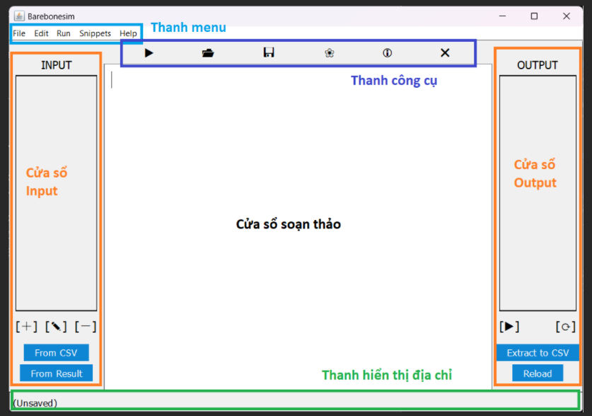
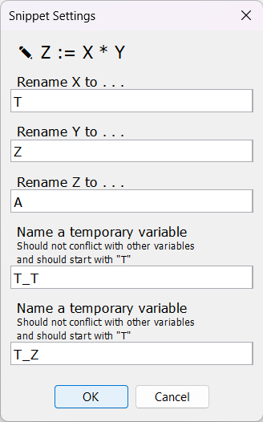
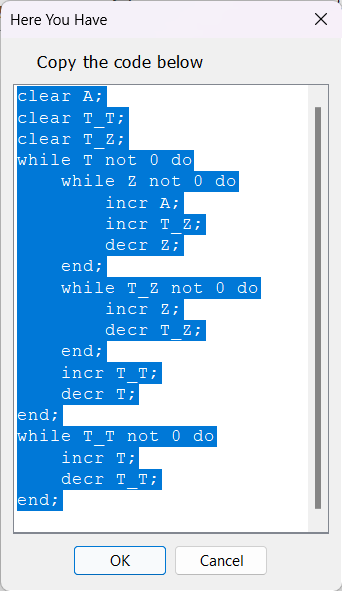
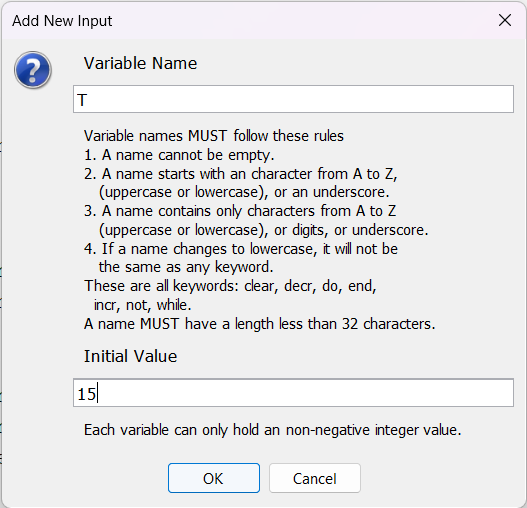
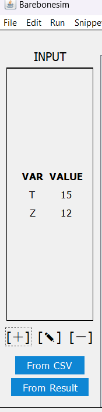
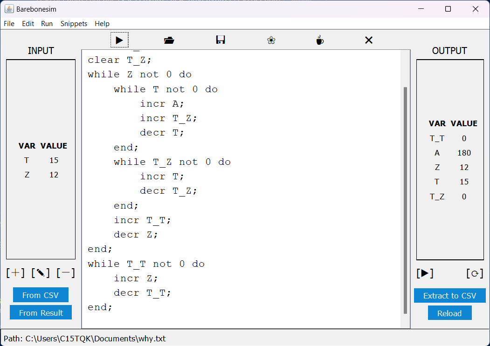

# Nghiên cứu cài đặt chương trình dịch cho ngôn ngữ lập trình Barebone

> [English translation here](README.en.md)

Repository này chứa nội dung cơ bản về ngôn ngữ lập trình Barebone, các đoạn
code cho các phép toán cơ bản và một chương trình biên dịch Barebone dùng giao diện đồ họa, nhằm phục vụ cho đề tài trình bày cuối kỳ môn học Nguyên lý và phương pháp lập trình.

Các mục tiêu của đề tài này là :

1. Trình bày ngôn ngữ lập trình Barebone.

2. Xây dựng chương trình cho phép biên dịch chương trình viết bằng Barebone để có thể thực thi được cho các phép toán cộng trừ nhân chia hai số nguyên, phép toán so sánh giữa hai số nguyên.

3. Giao diện chương trình biên dịch ở dạng đồ họa.

<!-- Các đề mục -->
<details open>
   <summary><em>Các đề mục</em></summary>
   <ol>
      <li>
         <a href="#ngôn-ngữ-lập-trình-barebone">Ngôn ngữ lập trình Barebone</a>
         <ul>
            <li><a href="#đặc-điểm-của-barebone">Đặc điểm của Barebone</a></li>
            <li><a href="#cú-pháp">Cú pháp</a></li>
            <li>
               <a href="#nhận-xét">Nhận xét</a>
               <ul>
                  <li><a href="#phép-toán-cơ-bản">Phép toán cơ bản</a></li>
                  <li><a href="#có-thể-thay-clear-bằng-vòng-lặp">Có thể thay clear bằng vòng lặp</a></li>
                  <li><a href="#biểu-diễn-số-nguyên-âm">Biểu diễn số nguyên âm</a></li>
               </ul>
            </li>
         </ul>
      </li>
      <li>
         <a href="#chương-trình-biên-dịch-ở-dạng-đồ-họa">Chương trình biên dịch ở dạng đồ họa</a>
         <ul>
            <li><a href="#yêu-cầu">Yêu cầu</a></li>
            <li><a href="#cài-đặt">Cài đặt</a></li>
            <li>
               <a href="#sử-dụng">Sử dụng</a>
               <ul>
                  <li><a href="#khởi-động">Khởi động</a></li>
                  <li><a href="#soạn-thảo">Soạn thảo</a></li>
                  <li><a href="#sử-dụng-code-có-sẵn">Sử dụng code có sẵn</a></li>
                  <li><a href="#đặt-giá-trị-ban-đầu-cho-biến">Đặt giá trị ban đầu cho biến</a></li>
                  <li><a href="#thực-thi-và-xem-kết-quả">Thực thi và xem kết quả</a></li>
               </ul>
            </li>
            <li><a href="#ví-dụ">Ví dụ</a></li>
            <li>
               <a href="#đặc-điểm">Đặc điểm</a>
               <ul>
                  <li><a href="#barebonesim-dịch-bb-bằng-cách-nào-">Barebonesim dịch BB bằng cách nào ?</a></li>
                  <li><a href="#barebonesim-có-hỗ-trợ-nhập-và-xuất-giá-trị-không-">Barebonesim có hỗ trợ nhập và xuất giá trị không ?</a></li>
                  <li><a href="#barebonesim-có-hỗ-trợ-comment-trong-code-không-">Barebonesim có hỗ trợ comment trong code không ?</a></li>
               </ul>
            </li>
            <li><a href="#đóng-góp">Đóng góp</a></li>
            <li><a href="#giấy-phép">Giấy phép</a></li>
         </ul>
      </li>
   </ol>
</details>

## Ngôn ngữ lập trình Barebone

### Đặc điểm của Barebone

Barebone là một ngôn ngữ lập trình thủ tục với các đặc điểm :

- Không có chương trình con như hàm hay thủ tục.

- Mã nguồn chỉ bao gồm các *câu lệnh* (statement). Mỗi câu lệnh phải kết thúc bằng dấu chấm phẩy `;`.

- Kiểu dữ liệu duy nhất là **số nguyên không âm**.

- Các biến đều là toàn cục (global). Khi được nhắc đến lần đầu trong một câu lệnh, biến được gán bằng không trước khi câu lệnh đó được thực thi.

- Cấu trúc lặp có thể nằm lồng trong cấu trúc lặp khác.

- Không có đầu ra và đầu vào chuẩn.

- *Không* phân biệt chữ hoa và thường (case-insensitive). Chẳng hạn, `X` và `incr` đôi một tương đương với `x` và `INCR`.

- Các từ khóa là `clear`, `decr`, `do`, `end`, `incr`, `not`, `while`.

- Tên biến chỉ được bao gồm các chữ cái hoặc chữ số ASCII hoặc dấu underscore `_`. Tên biến không được bắt đầu với chữ số. Tên biến không phân biệt chữ hoa và thường. Tên biến không được giống một từ khóa nào.

### Cú pháp

Barebone sử dụng ba câu lệnh

- `clear X;` gán biến mang tên `X` bằng 0.

- `incr X;` tăng giá trị của biến `X` lên một.

- `decr X;` giảm giá trị của biến `X` đi một nếu `X` lớn hơn không.

và một cấu trúc lặp

```
while X not 0 do ... end;
```

được thực thi như sau :

1. Nếu `X` bằng không thì thoát vòng lặp, nếu không thì tiếp tục.

2. Thực hiện tuần tự những câu lệnh ở vị trí `...` cho đến câu lệnh `end;` và
   quay lại bước 1.

Mỗi dấu cách đều có thể thay bằng ký tự xuống dòng hay *tab* (bốn dấu cách) để dễ đọc, chẳng hạn `while X not 0 do decr X end;` thì cũng tương đương với

```
while X not 0 do
    decr X;
end;
```

và

```
while X not 0 do
decr X;
end;
```

Nên ngắt dòng và tab đúng chỗ để code dễ đọc hơn.

Ví dụ về một đoạn mã nguồn hợp lệ :

```
clear Y;
clear T;
while X not 0 do
    incr Y;
    incr T;
    decr X;
end;
while T not 0 do
    incr X;
    decr T;
end;
```

### Nhận xét

Các file được nhắc đến trong mục này có thể tìm thấy ở `app/src/main/resources/snippets/`.

#### Phép toán cơ bản

- Cấu trúc rẽ nhánh `if X != 0 then X := 0 else X := 1` ở file `toggle.txt`, có thể gọi là `invert X`.

- Phép cộng `Z := X + Y` ở file `add.txt`.

- Phép trừ `Z := X - Y` ở file `subtract.txt`.

- Phép nhân `Z := X * Y` ở file `multiply.txt`.

- Phép chia nguyên `Z := floor(X / Y)` ở file `int_divide.txt`.

- Phép so sánh `if X < Y then Z := 0 else Z := 1` ở file `less_than.txt`, có thể viết lại bằng pseudo-code như sau :

```
Z := 0
T_X := X
T_Y := Y
while T_Y != 0 do
    Z := Z + 1
    T_Y := T_Y - 1
while T_X != 0 do
    if Z > 0 then Z := Z - 1
    T_X := T_X - 1
T_X := T_X + 1
while Z != 0 do
    T_X := 0
    Z := 0
while T_X != 0 do
    Z := Z + 1
    T_X := T_X - 1
```

- Các phép so sánh khác có thể tìm thấy ở `not_less_than.txt`,
   `greater_than.txt`, `not_greater_than.txt`, `equals.txt`,
   `not_equals.txt`.

#### Có thể thay clear bằng vòng lặp

Ta nhận thấy có thể thay thế `clear X;` bằng đoạn mã sau

```
while X not 0 do
    decr X;
end;
```

#### Biểu diễn số nguyên âm

Có thể biểu diễn một số nguyên *có dấu* $X$ trong Barebone bằng cách dùng một biến dấu. Biến dấu `X_NEG` bằng không nếu $X \ge 0$, nếu không thì nó khác không.

Ví dụ, số nguyên $X$ có thể được biểu diễn bới

- `X` mang giá trị tuyệt đối của $X$ và

- `X_NEG` là biến dấu.

Ta có thể đổi dấu của $X$ như sau

```
if X_NEG != 0 then X_NEG := 0 else X_NEG := 1
```

## Chương trình biên dịch ở dạng đồ họa

**Barebonesim** (Barebone + Simulator) là chương trình Java giả lập quá trình biên dịch Barebone với giao diện đồ họa. Barebonesim được xây dựng bằng Gradle 7.5.1.

### Yêu cầu

Cần Oracle JDK từ 1.8 trở lên. Kiểm tra phiên bản của Java bằng dòng lệnh

```powershell
java -version
```

Nếu không có sẳn Java, hãy tải về theo hướng dẫn tại [java.com](https://www.java.com/en/download/) và chạy lại lệnh trên để kiểm tra phiên bản.

### Cài đặt

Clone repo này.

```
git clone https://github.com/hnthap/barebonesim.git -depth 1
```

### Sử dụng

#### Khởi động

Ở thư mục gốc (chứa file `gradlew`), chạy dòng lệnh sau

```powershell
./gradlew run
```

Cửa số sau sẽ hiện ra :

<p align="center" width="100%"></p>

Cửa sổ chính bao gồm :

- Thanh menu bao gồm các lệnh cơ bản để thao tác với file và code.

- Thanh công cụ bao gồm các nút, từ trái sang phải, là chạy code, mở file, lưu file, kiểm tra lỗi đồng thời "làm đẹp" code, tạo snippet (các đoạn code có sẵn) và thoát file.

- Cửa sổ soạn thảo soạn thảo mã nguồn (code).

- Cửa sổ Input thao tác với các biến đầu vào.

- Cửa sổ Output thao tác với kết quả sau khi thực thi code.

- Thanh hiển thị địa chỉ hiển thị địa chỉ tuyệt đối của file code đang mở.

#### Soạn thảo

Có thể viết code trực tiếp vào cửa sổ soạn thảo, hoặc mở file code bằng cách
nhấn vào `🗁` trên thanh công cụ và chọn file cần tìm. Sau khi soạn thảo, lưu bằng cách nhấn vào `💾` trên thanh công cụ và nhập tên rồi lưu file.

Trong quá trình soạn thảo, có thể kiểm tra lỗi và "làm đẹp" code bằng cách nhấn vào `❀` (biểu tượng bông hoa) trên thanh công cụ.

#### Sử dụng code có sẵn

Để tiết kiệm thời gian soạn thảo, có thể sử dụng các đoạn code có sẵn giúp thực hiện các phép tính cơ bản (cộng, trừ, nhân, chia, gán giá trị, so sánh, chuyển từ không thành khác không và ngược lại, đổi dấu).

#### Đặt giá trị ban đầu cho biến

Sử dụng cửa sổ Input (bên trái cửa sổ soạn thảo), ta có thể gán giá trị ban
đầu cho một số biến.

- Để thêm biến, chọn `[+]`. Trong cửa sổ vừa hiện ra, nhập tên biến và giá trị ban đầu của nó rồi chọn OK.

- Để thay đổi giá trị của biến, chọn `[✎]`. Chọn biến cần chỉnh sửa, chọn OK rồi nhập giá trị mới, chọn OK.

- Để xóa một biến khỏi danh sách, chọn `[-]`. Chọn biến cần xóa và chọn OK.

Đây là giá trị ban đầu của các biến trước khi code được thực thi.

> Ngoài ra, các biến này có thể được thêm từ file CSV. Nhấn nút ` From CSV `
> và chọn file cần tìm. File CSV tuân theo
> [RFC 4180](https://www.ietf.org/rfc/rfc4180.txt) và *không chứa dòng
> header*.
> 
> Một ví dụ về file CSV hợp lệ :
> 
> ```csv
> X,12
> Y,20
> Z,0
> ```

#### Thực thi và xem kết quả

Sau khi đã có code và danh sách biến với giá trị ban đầu, có thể thực thi
(chạy code) bằng cách chọn `▶` trên thanh công cụ.

Nếu code có lỗi (tên biến không phù hợp, vòng lặp vô hạn v.v.) hoặc chạy quá
thời gian giới hạn (mặc định là $1000 \;\textrm{ms}$), chương trình sẽ báo lỗi và ngưng chạy.

Nếu chạy thành công, các giá trị *sau khi thực thi* của biến sẽ hiển thị trên cửa sổ Output (bên phải cửa sổ soạn thảo).

> Lưu kết quả vào file CSV bằng nút ` Extract to CSV ` trên cửa sổ Output.
> 
> Đem các giá trị của cửa sổ Output sang cửa sổ Input bằng nút ` From Result ` trên cửa sổ Input.

Nếu code và giá trị ban đầu của các biến (Input) có thay đổi sau khi đã thực
thi, có thể cập nhật giá trị Output mới bằng cách chạy lại.

### Ví dụ

Ví dụ, để tạo đoạn code thực hiện `A := Z * T` với các giá trị của `Z` và `T` cho trước :

1. Trên thanh menu, chọn File &rarr; New File rồi tạo file mới.

2. Sau khi tạo và mở file mới, trên thanh menu, chọn Snippets → Snippets.

3. Trên cửa sổ "Snippets" mới hiện ra, chọn `Z := X * Y` rồi chọn OK.

4. Trên cửa sổ "Snippet Settings", thay đổi tên các biến như hình rồi chọn OK.
   
   <p align="center" width="100%"></p>
   
   > Chú ý đặt tên các biến tạm thời (temporary variables) sao cho không trùng với biến nào đang dùng. Các biến tạm thời trong một snippet không được trùng tên. Tên biến tạm thời nên bắt đầu với "T" hoặc "T_".
   > 
   > Chúng có thể được tái sử dụng nhiều lần. Sau mỗi phép tính cung cấp bởi snippet, các biến tạm đều mang giá trị không.

5. Trong cửa sổ mới hiện ra, tô chọn tất cả đoạn code trong khung và nhấn tổ
   hợp <kbd>Ctrl</kbd> + <kbd>C<kbd> (hoặc tương đương, để sao chép văn bản), rồi chọn OK.
   
   <p align="center" width="100%"></p>

6. Vào cửa sổ soạn thảo, rồi nhấn tổ hợp <kbd>Ctrl</kbd> + <kbd>V</kbd> (hoặc tương đương, để dán đoạn văn bản vừa sao chép).

7. Bấm nút `[+]` trên cửa sổ Input (bên trái cửa sổ soạn thảo) rồi điền tên và giá trị ban đầu của biến `Z` (ví dụ, bằng $12$).
   
   <p align="center" width="100%"></p>
   
   Làm tương tự với biến `T` (ví dụ, bằng $15$).
   
   <p align="center" width="100%"></p>
   
   Cửa sổ Input sẽ hiển thị như sau :
   
   <p align="center" width="100%"></p>

8. Bấm nút `▶` trên thanh công cụ để thực thi đoạn code. Có thể thấy kết quả gần giống như hình dưới :
   
   <p align="center" width="100%"></p>
   
   Nhìn vào cửa sổ Output (bên phải cửa sổ soạn thảo), ta thấy `A` bằng $180$ là kết quả cần tìm.

### Đặc điểm

#### Barebonesim dịch BB bằng cách nào ?

Code được biên dịch và thực thi theo các bước sau :

1. Các giá trị ban đầu của biến (trên cửa sổ Input, bên trái cửa sổ soạn thảo) được lưu vào một đối tượng `VariableContainer`, có tác dụng lưu trữ tất cả biến theo tên và giá trị của chúng.

2. *Parser* chuyển code thành một danh sách các *cây cú pháp trừu tượng* (Abstract Syntax Tree), mỗi cây biểu diễn một câu lệnh (statement). (Mỗi vòng lặp cũng là một câu lệnh.)

3. Trong khi *parse*, nếu phát hiện ra lỗi cú pháp, Parser sẽ ngừng lại và báo lỗi.

4. Nếu *parsing* thành công, một danh sách các cây cú pháp trừu tượng sẽ được lưu trong *Compiler* và được thực thi tuần tự trong một tiểu trình khác. Các thay đổi về giá trị biến sẽ được áp dụng lên bản sao của đối tượng `VariableContainer` ở bước đầu tiên.

5. Nếu Compiler thực thi code quá thời gian giới hạn (timeout), nó sẽ ngừng lại và báo lỗi. (Thời gian giới hạn là $1000 \;\textrm{ms}$ theo mặc định và có thể tùy chỉnh.)

6. Nếu thực thi thành công, các giá trị cuối cùng lưu trong `VariableContainer` sẽ được hiển thị trên cửa sổ Output (bên phải cửa sổ soạn thảo).

Tất cả các bước được thực hiện trong thời gian chạy (runtime) của
Barebonesim. **Không có file executable nào được tạo ra**.

#### Barebonesim có hỗ trợ nhập và xuất giá trị không ?

Theo khái niệm, Barebone chỉ hỗ trợ các câu lệnh `incr`, `decr`, `clear` và `while`, ngoài ra không có câu lệnh nào khác. Một số compiler cho Barebone hỗ trợ thêm `read` và `print` để nhập và xuất giá trị.

Tuy nhiên để nhấn mạnh tính đơn giản của BB, Barebonesim không hỗ trợ đầu vào và đầu ra chuẩn. Thay vào đó, có thể xem giá trị của các biến sau khi thực thi ở cửa sổ Output.

#### Barebonesim có hỗ trợ comment trong code không ?

Barebonesim chưa hỗ trợ comment trong code.

### Đóng góp

Nếu có bất kỳ đề xuất nào, xin quý vị tự do *fork* repo này và tạo một *pull request*. Mọi đóng góp đều đáng quý. Tôi có thể chậm phản hồi các *pull request*, nhưng tôi sẽ cố gắng phản hồi sau.

### Giấy phép

Phần mềm này được phân phối dưới giấy phép MIT. Xem thêm thông tin tại [`LICENSE`](License).

<!--Cảm ơn-->
